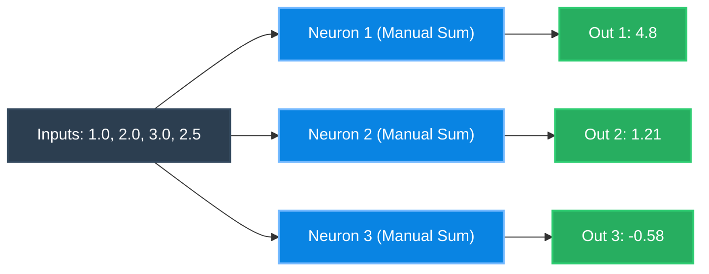
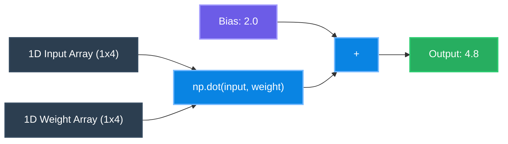
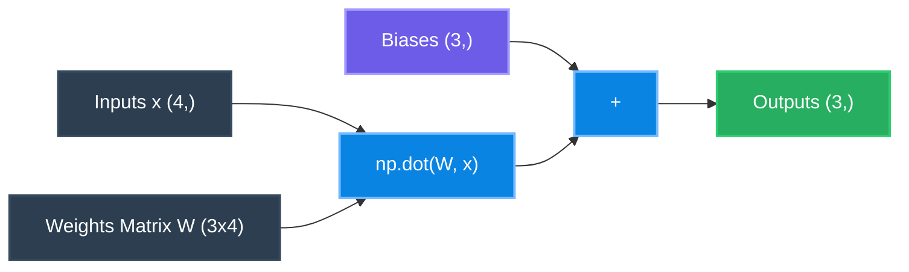
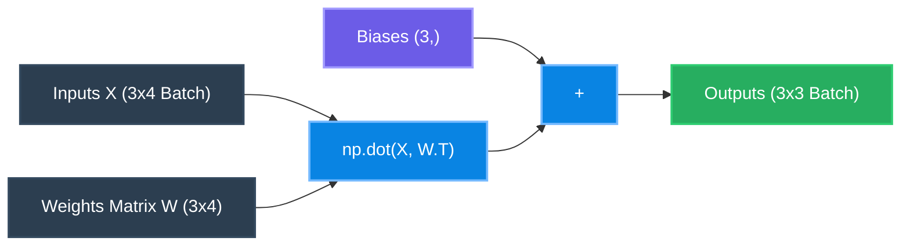
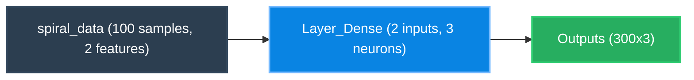
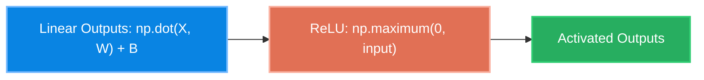
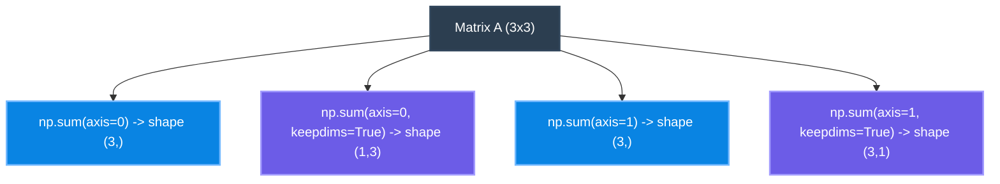
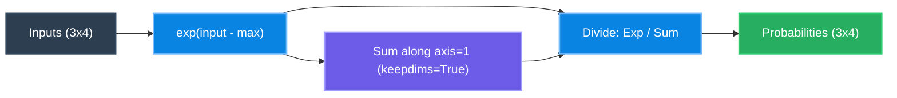

# Neural Network from Scratch (in Python)

Welcome to the **Neural Network from Scratch** repository! This project serves as a step-by-step educational guide to understanding the mathematical and structural foundations of deep learning. By building a neural network from first principles, this codebase transitions gradually from manual scalar arithmetic to matrix operations, batch processing, activation functions, and modular object-oriented abstractions using NumPy.

This repository documents the core implementation files situated directly in the root directory.

---

## 📂 Repository Structure

The core files in this repository are structured as follows:

```text
Neural_Network_from_Scratch/
│
├── Neuron1.py                         # Step 1: Manual 3-neuron layer calculation (directly indexed)
├── Neuron2.py                         # Step 2: Manual 3-neuron layer calculation (via unpacked weight lists)
├── Neuron3.py                         # Step 3: Single neuron using NumPy dot product
├── Layer_of_Neurons.py                # Step 4: Layer of 3 neurons (single sample) using np.dot
├── Transpose_usecase.py               # Step 5: Batch inputs matrix dot product requiring transposing (.T)
├── layering2.0.py                     # Step 6: Two sequential dense layers using manual np.dot & transpositions
├── dense_layer.py                     # Step 7: Modular object-oriented Layer_Dense class with nnfs spiral data
├── relu1.py                           # Step 8: Modular dense layer integrated with ReluActivation class
├── keepdims.py                        # Step 9: Tutorial on np.sum behavior (axes and keepdims=True)
├── softmax.py                         # Step 10: Standalone Softmax normalization implementation
├── 1st_Forward_Implement_No_Loss.py   # Step 11: Unified feedforward pipeline (Dense -> ReLU -> Dense -> Softmax)
└── prototype/                         # Historical prototype scripts directory
```

---

## 🧠 Step-by-Step Implementation & Architecture Diagrams

### Step 1: The Multi-Neuron Manual Layer
📄 **Files:** [Neuron1.py](file:///c:/Users/User/OneDrive/Desktop/Neural_Network_from_Scratch/Neuron1.py) & [Neuron2.py](file:///c:/Users/User/OneDrive/Desktop/Neural_Network_from_Scratch/Neuron2.py)

To calculate output for a fully connected layer containing 3 neurons, we multiply a single 4-dimensional input vector by the unique weights of each neuron and add their corresponding biases.

$$y_j = \sum_{i=1}^{n} (x_i \cdot w_{j,i}) + b_j$$

#### 📊 Architecture Diagram


---

### Step 2: Vector Math (NumPy Dot Product)
📄 **File:** [Neuron3.py](file:///c:/Users/User/OneDrive/Desktop/Neural_Network_from_Scratch/Neuron3.py)

Replaces manual loop iterations with the dot product of two 1D NumPy arrays, demonstrating a clean implementation of a single neuron.

#### 📊 Architecture Diagram


---

### Step 3: Layer of Neurons (Matrix Multiplication)
📄 **File:** [Layer_of_Neurons.py](file:///c:/Users/User/OneDrive/Desktop/Neural_Network_from_Scratch/Layer_of_Neurons.py)

Groups individual weight vectors of multiple neurons into a single 2D weight matrix ($W$) of shape `(3, 4)`. Computing the outputs is vectorized using matrix-vector multiplication with input vector ($x$).

$$\text{Output} = W \cdot x + b$$

#### 📊 Architecture Diagram


---

### Step 4: Batch Processing & Matrix Transposition
📄 **File:** [Transpose_usecase.py](file:///c:/Users/User/OneDrive/Desktop/Neural_Network_from_Scratch/Transpose_usecase.py)

To process a batch of inputs, the input vector becomes a 2D matrix ($X$) of shape `(n_samples, n_features)`. In order to align dimensions for dot-product multiplication with the weight matrix $W$ of shape `(n_neurons, n_features)`, we must transpose the weight matrix ($W^T$).

$$\text{Output} = X \cdot W^T + b$$

#### 📊 Architecture Diagram


---

### Step 5: Chaining Sequential Layers
📄 **File:** [layering2.0.py](file:///c:/Users/User/OneDrive/Desktop/Neural_Network_from_Scratch/layering2.0.py)

Passes batch inputs through two sequential layers. The outputs of the first layer serve as the input vector to the second layer.

#### 📊 Architecture Diagram


---

### Step 6: Object-Oriented Modularity
📄 **File:** [dense_layer.py](file:///c:/Users/User/OneDrive/Desktop/Neural_Network_from_Scratch/dense_layer.py)

Introduces the `Layer_Dense` class. The weights are initialized with shape `(n_inputs, n_neurons)` using `0.01 * np.random.randn(...)`, which avoids the need to transpose weights during forward passes:

$$\text{Output} = X \cdot W + b$$

It uses the `nnfs` library to generate a non-linear spiral dataset ($X, y$) to verify the class.

#### 📊 Architecture Diagram


---

### Step 7: Rectified Linear Unit (ReLU) Activation
📄 **File:** [relu1.py](file:///c:/Users/User/OneDrive/Desktop/Neural_Network_from_Scratch/relu1.py)

Introduces non-linear mappings via a `ReluActivation` class. It enforces:

$$f(x) = \max(0, x)$$

This step feeds the linear output of `Layer_Dense` through `ReluActivation`.

#### 📊 Architecture Diagram


---

### Step 8: Understanding NumPy Summing Dimensions
📄 **File:** [keepdims.py](file:///c:/Users/User/OneDrive/Desktop/Neural_Network_from_Scratch/keepdims.py)

A diagnostic utility demonstrating how `np.sum(axis, keepdims=True)` behaves. This is a crucial concept for understanding how inputs are normalized during the softmax calculation.

#### 📊 Concept Diagram


---

### Step 9: Softmax Activation (Probability Distribution)
📄 **File:** [softmax.py](file:///c:/Users/User/OneDrive/Desktop/Neural_Network_from_Scratch/softmax.py)

Implements Softmax calculation for multi-class classification. Subtraction of the row maximum ($x_{\max}$) prevents exponent overflow:

$$S_{i,j} = \frac{e^{z_{i,j} - z_{i,\max}}}{\sum_{k} e^{z_{i,k} - z_{i,\max}}}$$

#### 📊 Architecture Diagram


---

### Step 10: Unified Feedforward Implementation
📄 **File:** [1st_Forward_Implement_No_Loss.py](file:///c:/Users/User/OneDrive/Desktop/Neural_Network_from_Scratch/1st_Forward_Implement_No_Loss.py)

Chains together the completed pieces into a single feedforward pipeline: 
Input Spiral Data $\rightarrow$ Dense Layer 1 $\rightarrow$ ReLU Activation $\rightarrow$ Dense Layer 2 $\rightarrow$ Softmax Output Activation.

#### 📊 Architecture Diagram


---

## 🚀 Getting Started

### Prerequisites

You need Python 3, NumPy, and the `nnfs` helper library installed:

```bash
pip install numpy nnfs
```

### Running the Code

To execute the completed feedforward neural network pipeline and view the output class probabilities:

```bash
python 1st_Forward_Implement_No_Loss.py
```
